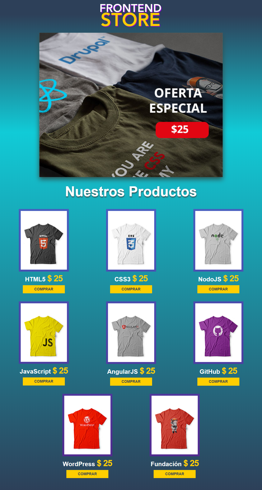
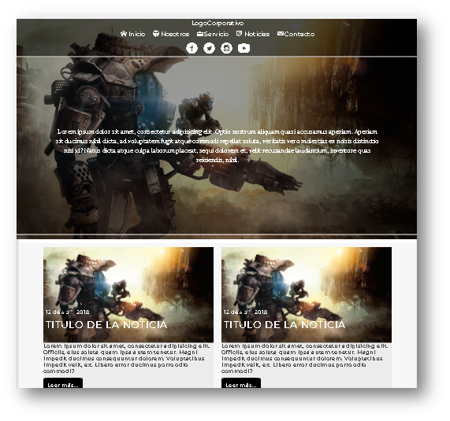
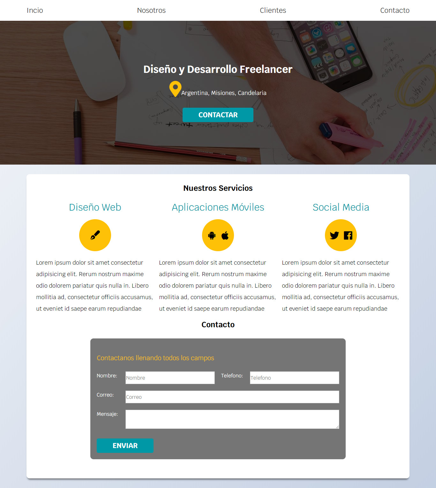

# Layout-Frontend

# Personal projects as a practice

## 1st Proyect:

### The design of a very basic store was used, to build its structure was made use of FlexBox.

> [----->view<-----](https://github.com/FabriJuncal/Layout-Frontend/tree/master/1st%20project)

## 2nd project:

### Like the previous project flexbox was used in this case a structure for a home was developed

> [----->view<-----](https://github.com/FabriJuncal/Layout-Frontend/tree/master/2nd%20project)

## 3rd project:

### Using flexbox, a modern and simple structure was developed.

> [----->view<-----](https://github.com/FabriJuncal/Layout-Frontend/tree/master/3rd%20Proyect)
